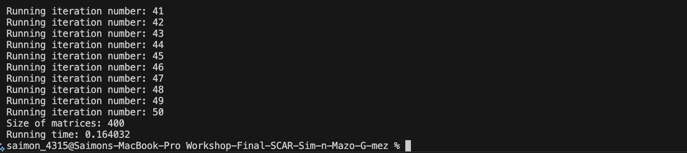

## HOW TO RUN ⚡️

### 1. Clonar el repositorio
git clone https://github.com/Smg4315/Workshop-Final-SCAR-Sim-n-Mazo-G-mez

### 2. Entrar al directorio del proyecto
cd Workshop-Final-SCAR-Sim-n-Mazo-G-mez

### 3. Crear el directorio bin dentro de la carpeta del proyecto
mkdir bin

### 4. Compilar el archivo mmm_implementation.c dentro de bin
clang -o bin/mmm mmm_implementation.c

### 5. Ejecutar en tu PC
./bin/mmm

## METHODS AND COMPILER USED:
- Pointers to acces and manage storage in a optimizated way, it already reduce.
- I tried to use OpenMP and virtuazlization but in mac is kinda hard. Anyway, i let the code with it, hopiung that it runs on Linux (specifically in APOLO)
- The compiler used was Clang :) 

## EVIDENCE

-> Let's print the time before optimizing (setting the size of the matrix in 400, allowing it to be a fair comparission)

*Time Before optimizing:*

*Time After optimizing only with pointers:*

As we can see, even if the time didnt reduced too much (maybe using OpenMP could be more optimized) it got a significant reduce that confirms the importance of pointers

*Time After optimizing it with pointers and OpenMP*

Difficults that i had developing the workshop:

- I didnt know how does C works, so i had to learn its basic sintaxis, etc...
- I had to change a couple of parts of the code, specifically in the matriz definition, i changed it because it was designed for and arm64 arquitecture (one that its not mine), so i definided it normal.
- Mostly of things that was suggested to implement to optimize the coded wasnt in my radar, so i had to try to learn pounds of new things.
- I tried to optimize using OpenMP (parallelization) and virtualization but because of my SO it was very hard and robust, even getting it, it was useless cause the running time didnt reduced to much with it so we're letting it just with pointers :/ -> I will run the code on anothe computer that do has Linux and in that way i can test it :D
