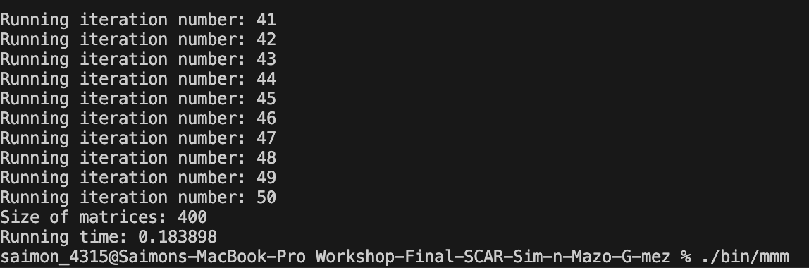

## HOW TO RUN 
---
## METHODS USED:
- Pointers to acces and manage storage in a optimizated way, it already reduce.
- 

## EVIDENCE

-> Let's print the time before optimizing (setting the size of the matrix in 400, allowing it to be a fair comparission)

*Time Before optimizing:*

Difficults that i had developing the workshop:

- I didnt know how does C works, so i had to learn its basic sintaxis, etc...
- I had to change a couple of parts of the code, specifically in the matriz definition, i changed it because it was designed for and arm64 arquitecture (one that its not mine), so i definided it normal.
- Mostly of things that was suggested to implement to optimize the coded wasnt in my radar, so i had to try to learn pounds of new things.
